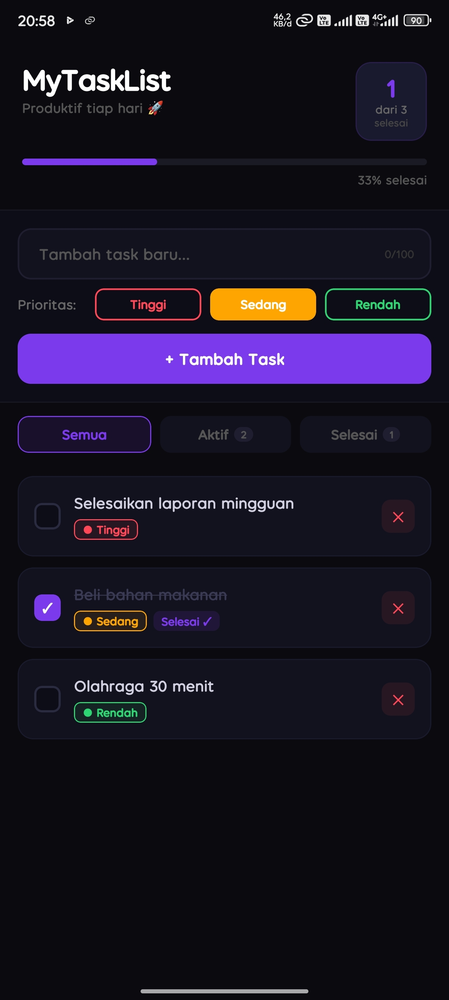
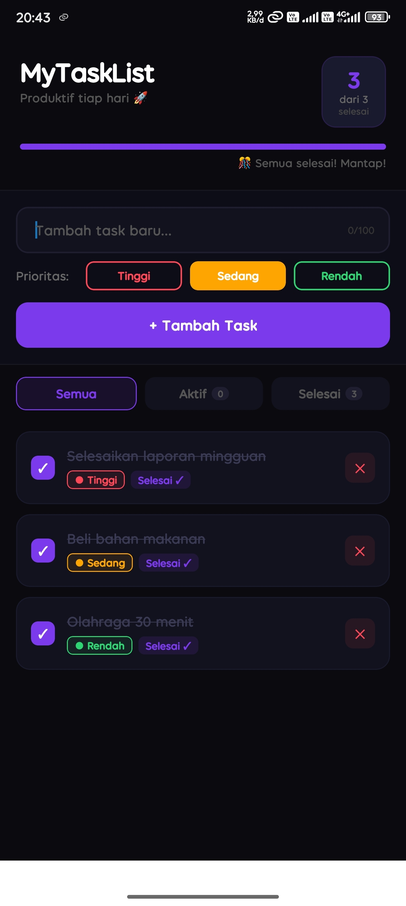
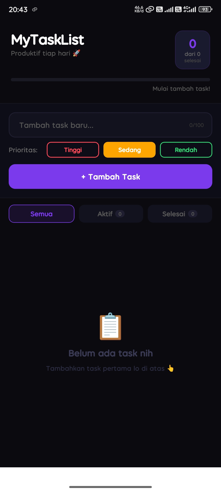

# 📋 MyTaskListApp

**Mini Project P07 — React Native (Expo)**

---

## 👤 Identitas Mahasiswa

| Field | Detail |
|-------|--------|
| Nama | Muhammad Faried Permana |
| NIM  | 243303621239 |
| Kelas | 4 Pagi A |

---

## 📱 Deskripsi Aplikasi

**MyTaskList App** adalah aplikasi task manager / to-do list modern berbasis React Native (Expo) dengan tema gelap elegan. App ini memungkinkan pengguna mengelola tugas harian dengan fitur penanda prioritas (Tinggi/Sedang/Rendah), filter status task, progress tracker, dan manajemen task lengkap (tambah, hapus, tandai selesai).

---

## ✅ Fitur yang Diimplementasikan

### Requirement Wajib
- [x] ① **Setup & Running di HP Fisik** — Dibuat dengan `npx create-expo-app`, dijalankan via Expo Go
- [x] ② **Komponen Dasar** — `View`, `Text`, `TouchableOpacity`, `StyleSheet.create`, Flexbox layout
- [x] ③ **State Management (useState)** — `inputText` state + `tasks` array state + conditional rendering (badge selesai, empty state, progress bar)
- [x] ④ **Form Input & Validasi** — `TextInput` + `KeyboardAvoidingView` + validasi kosong + validasi minimal 3 karakter + pesan error informatif
- [x] ⑤ **FlatList Dinamis** — `FlatList` dengan `keyExtractor` + `ListEmptyComponent` dengan tampilan berbeda per filter
- [x] ⑥ **Fitur CRUD** — Add task + Delete task (dengan konfirmasi Alert)

### Fitur Tambahan
- [x] Mark as Done — Ketuk task untuk toggle selesai/belum selesai
- [x] Prioritas Task — Tinggi (merah), Sedang (kuning), Rendah (hijau) dengan warna berbeda
- [x] Counter "X task selesai dari Y total" + progress bar persentase
- [x] Filter View — Tab Semua / Aktif / Selesai dengan badge count
- [x] UI yang sangat rapi, konsisten, dan profesional (dark theme elegan)

---

## 🎨 Fitur Unggulan

- **Dark Theme** — Palette gelap `#0A0A0F` dengan aksen ungu `#7C3AED`
- **Animated Cards** — Task card dengan spring animation saat ditekan
- **Progress Bar** — Visual progress persentase task selesai di header
- **Smart Empty State** — Pesan empty state berbeda tergantung filter aktif
- **Character Counter** — Input dibatasi 100 karakter dengan counter live
- **Konfirmasi Delete** — Alert konfirmasi sebelum menghapus task

---

## 📸 Screenshot

| Tampilan utama dengan daftar task | Filter Selesai aktif | Empty state |
|---|---|---|
|  |  |  |

---

## 🚀 Cara Menjalankan Project

### Prerequisites
- Node.js (v18+)
- npm / yarn
- Expo Go app di HP fisik (download dari App Store / Play Store)

### Langkah-langkah

```bash
# 1. Clone repository
git clone https://github.com/fariidd04/mytasklistapp.git
cd mytasklistapp

# 2. Install dependencies
npm install

# 3. Jalankan development server
npx expo start

# 4. Scan QR Code dengan Expo Go (Android) atau Camera (iOS)
```

---

## 🏗️ Struktur Project

```
MyTaskList-App/
├── App.js              # Komponen utama & semua logika
├── package.json        # Dependencies Expo
├── app.json            # Konfigurasi Expo
└── README.md           # Dokumentasi ini
```

---

## 🔧 Konsep React Native yang Diimplementasikan

| Konsep | Implementasi |
|--------|-------------|
| **P02 - Komponen Dasar** | `View`, `Text`, `TouchableOpacity`, `Animated.View` |
| **P03 - Layout & Styling** | `StyleSheet.create()`, Flexbox (`flex`, `flexDirection`, `gap`) |
| **P04 - State Management** | `useState` untuk `inputText`, `tasks`, `selectedPriority`, `activeFilter`, `inputError` |
| **P05 - Form & Validasi** | `TextInput`, `KeyboardAvoidingView`, validasi + error message |
| **P06 - List Dinamis** | `FlatList`, `keyExtractor`, `ListEmptyComponent` |

---

## 🔗 Live Demo

- [Expo Snack](https://snack.expo.dev/@fariid.dd/mytasklistapp)

---